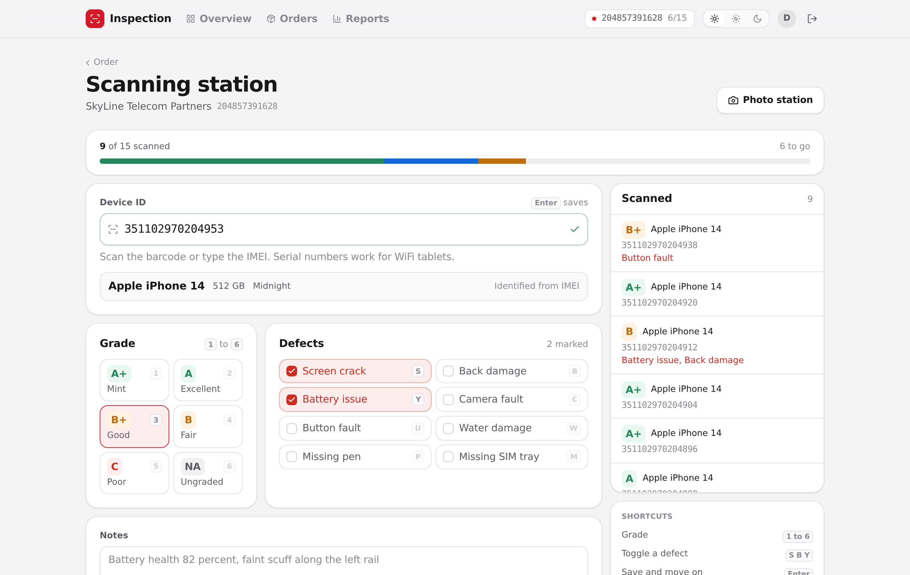
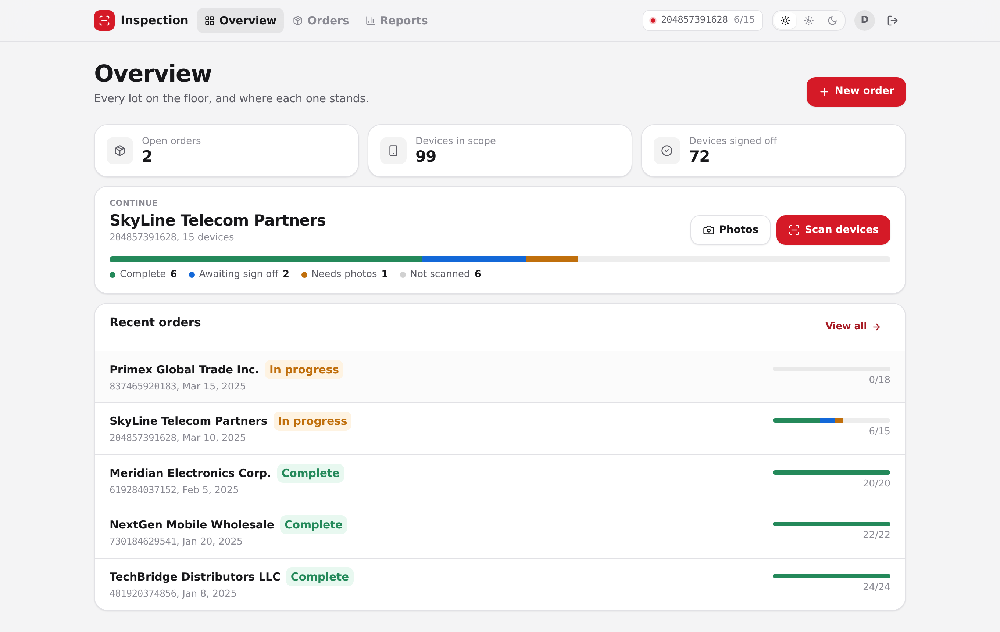
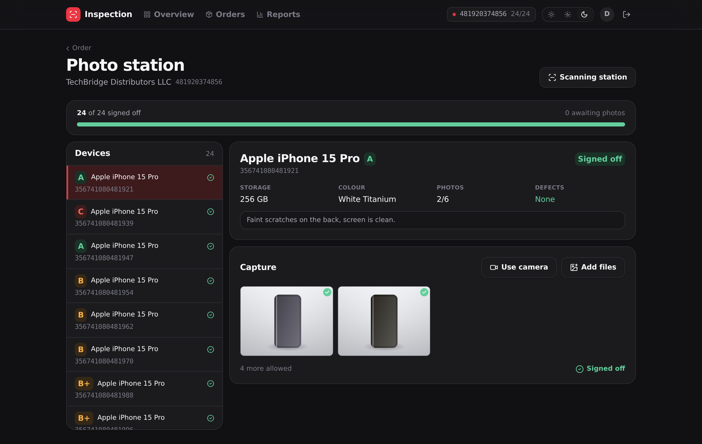
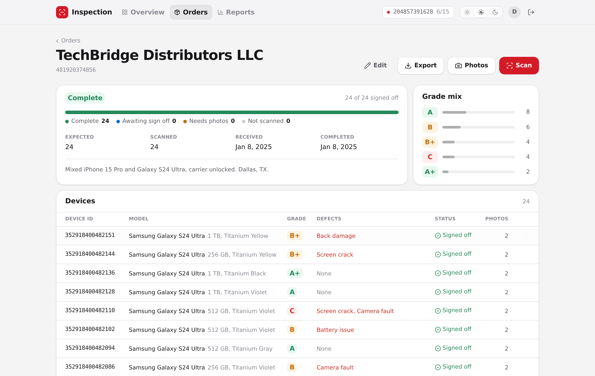
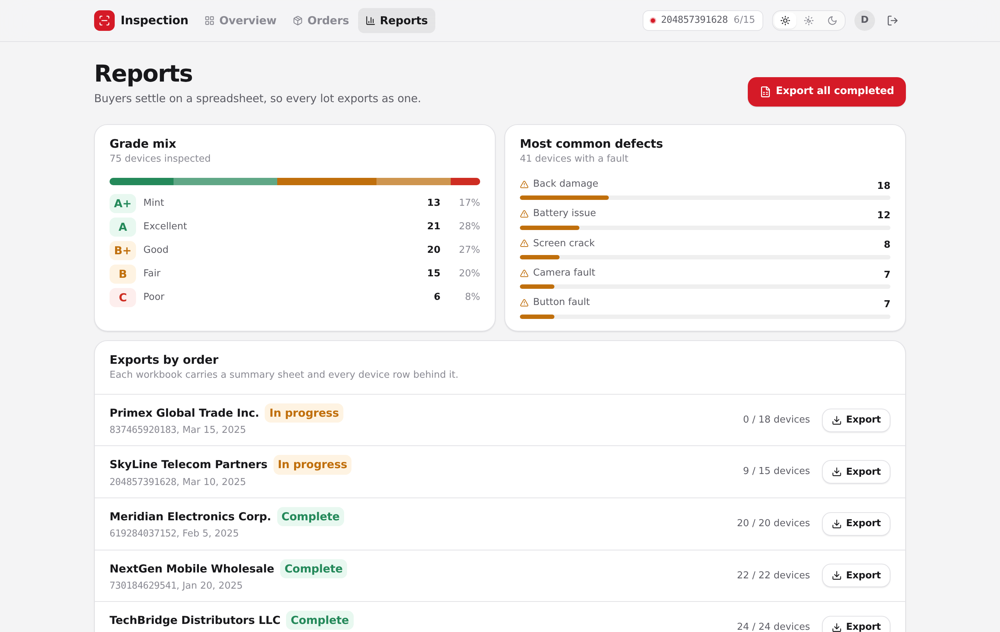
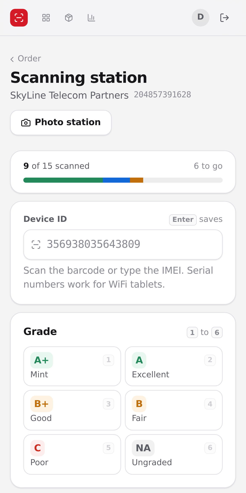

<div align="center">

# Phone Inspection

**Scanner first intake, grading and reporting for wholesale phone lots.**

[](https://github.com/SBamehriz/Inspection-software/actions/workflows/ci.yml)
[](LICENSE)
[](https://nodejs.org)
[](#security)

</div>

Wholesale phone lots arrive by the hundred. Every device has to be identified, graded, photographed and signed off, and the buyer settles on a spreadsheet at the end. Done by hand that means reading a barcode out loud, typing a model twice and clicking a grade out of a dropdown, for every device, all day.

This app takes the typing out. You scan a device and it identifies itself from the IMEI. One keystroke grades it, one more flags a defect, and <kbd>Enter</kbd> saves it and gets the next scan ready. Your hands never leave the scanner.

```bash
git clone https://github.com/SBamehriz/Inspection-software.git
cd Inspection-software
npm install
npm run dev
```

Open <http://localhost:5000> and sign in with any username and password. Five sample orders are already loaded. No database, no API keys, no Python.



---

## Contents

- [What it saves you typing](#what-it-saves-you-typing)
- [The workflow](#the-workflow)
- [The Excel export](#the-excel-export)
- [Design](#design)
- [Architecture](#architecture)
- [Development](#development)
- [Security](#security)
- [What is a demo and what is real](#what-is-a-demo-and-what-is-real)
- [Contributing](#contributing)

## What it saves you typing

| Doing it by hand | What happens instead |
| --- | --- |
| Reading the model off the box | The Type Allocation Code inside the IMEI gives you brand, model, storage and colour |
| Finding a misread barcode at the end of the day | The Luhn check digit is verified as you type, and it tells you what went wrong |
| Cleaning up whatever the scanner emitted | Labels like `IMEI:` and `S/N:`, stray spaces and trailing newlines get stripped on the way in |
| Picking a grade from a dropdown | <kbd>1</kbd> to <kbd>6</kbd> grade the device, and the options stay on screen with their keys |
| Ticking defect checkboxes | <kbd>S</kbd> <kbd>B</kbd> <kbd>Y</kbd> <kbd>C</kbd> <kbd>U</kbd> <kbd>W</kbd> <kbd>P</kbd> <kbd>M</kbd> toggle the eight common faults |
| Clicking save, then clicking the next field | <kbd>Enter</kbd> saves and puts the cursor back in the ID field |
| Grading an identical lot device by device | The grade carries over until you change it |
| Deciding whether it is an IMEI or a serial | WiFi tablets carry serials rather than IMEIs, and the field works out which one it got |
| Building the spreadsheet for the buyer | Every order exports as a styled workbook with several sheets |

The ID field hands focus off as soon as it holds a complete IMEI. That way a scanner can keep typing digits, and the single key shortcuts become live the moment it finishes.

Two rules live in the API rather than only in the screens. A device is not finished until it has photo evidence, and an order is not finished until every expected device is signed off. Delete a device or raise the expected count and the order opens back up.

## The workflow

Order, then scanning station, then photo station, then Excel.

<table>
<tr>
<td width="50%"></td>
<td width="50%"></td>
</tr>
<tr>
<td><b>Overview.</b> Every lot on the floor, and one button back into the one you were working on.</td>
<td><b>Photo station.</b> The queue moves itself to the next device that needs photos. Camera or file upload, and images get shrunk in the browser before they are stored.</td>
</tr>
<tr>
<td></td>
<td></td>
</tr>
<tr>
<td><b>Order detail.</b> Progress split by state, the grade mix for the lot, and every device row.</td>
<td><b>Reports.</b> Grade and defect mix across the floor, plus a workbook per order.</td>
</tr>
</table>

The progress bar is one bar with three segments, for complete, photographed but not signed off, and scanned only. Those are three different problems, and a single percentage would hide two of them.

## The Excel export

Reports are what the customer actually gets, so they are built in the app rather than handed off to a script. [`server/services/xlsx.ts`](server/services/xlsx.ts) is an OOXML writer with no dependencies. It does styled cells, column widths, frozen headers, autofilters, merges and real date and percentage types, and packs the result into a ZIP by hand in about 450 lines.

It replaced openpyxl, pandas and a Python subprocess. The obvious alternative, exceljs, costs 23 MB, nine transitive dependencies and a standing advisory, for roughly ten times the feature set this needs. The output is [checked against two independent parsers](server/services/xlsx.test.ts).

Every workbook opens on a summary sheet with the order, its progress, the grade breakdown and the defect breakdown, and keeps every device row behind it so you can filter. Grade cells use the same colours as the app.

## Design

The interface follows the [fluid interface](https://developer.apple.com/videos/play/wwdc2018/803/) ideas from Apple, translated to the web.

- **Springs rather than durations.** Motion is critically damped by default, so `bounce: 0`. Overshoot is saved for motion that follows something you committed to, like a scan landing in the queue. A spring animates from wherever the element currently is, so you can interrupt a transition and reverse it halfway through.
- **Feedback on press.** Buttons respond when you press down, not when you let go.
- **Translucent chrome.** The navigation bar is a material with content moving underneath it, and the blur gets heavier as the surface gets bigger.
- **Type that changes shape with size.** Tracking tightens as type grows and leading loosens as it shrinks. One `letter-spacing` for every size is always wrong somewhere.
- **Three accessibility preferences, each answered on its own.** `prefers-reduced-motion` swaps travel for cross fades without taking the feedback away, `prefers-reduced-transparency` makes the materials solid, and `prefers-contrast` strengthens lines and ink.
- **Light and dark**, either following the system or set by hand.

Colour means something here. One accent for the primary action, and green, amber and red only where they mean complete, needs attention and faulty. Every screen is checked for horizontal overflow from 360 px up.



## Architecture

```
client/src
  components/    Domain components like the grade picker and progress bar, plus ui/ primitives
  lib/           API client, motion vocabulary, theme, image handling
  pages/         One file per screen
server
  routes.ts      The HTTP API
  storage.ts     In memory store, seeded with five lots that come out the same every boot
  services/      Device identification, XLSX writer, report builder, seed photos
shared           Grades, defects, IMEI validation and Zod schemas that both sides use
```

`shared/` is the whole point. A grade means the same thing in the scanning form, in the API validator and in the exported spreadsheet, because all three import the same module.

**Stack.** React 18, TypeScript, Tailwind, Framer Motion, TanStack Query and Wouter on the client. Node, Express 5 and Zod on the server. 18 runtime dependencies and no code generation in the build.

<details>
<summary><b>HTTP API</b></summary>

| Method | Path | What it does |
| --- | --- | --- |
| `GET` | `/api/health` | Liveness, no auth needed |
| `POST` | `/api/auth/signin` and `/api/auth/signout` | Session lifecycle |
| `GET` | `/api/auth/user` | The current session |
| `GET` `POST` | `/api/orders` | List and create orders |
| `GET` `PATCH` | `/api/orders/:id` | An order with its devices, and edits |
| `GET` | `/api/orders/by-number/:orderNumber` | Look an order up by its printed number |
| `GET` | `/api/orders/:id/inspections` | Devices in an order |
| `GET` | `/api/orders/:id/inspections/:deviceId` | One device inside an order |
| `GET` | `/api/devices/:deviceId` | Identify a device from its IMEI or serial |
| `POST` `PATCH` `DELETE` | `/api/inspections[/:id]` | Record, amend and remove devices |
| `POST` | `/api/inspections/:id/images` and `/complete` | Attach photos, sign off |
| `GET` | `/api/reports/summary` | Grade and defect mix |
| `GET` | `/api/orders/:id/report.xlsx` and `/api/reports/completed.xlsx` | Workbooks |

Every route except `/api/health` needs a session and answers `401` without one.

</details>

## Development

```bash
npm run dev      # development server with HMR, on port 5000
npm test         # 73 tests
npm run check    # typecheck
npm run build    # production bundle
npm start        # serve the build, set SESSION_SECRET first
```

You need Node 20.19 or newer. Configuration is optional and documented in [`.env.example`](.env.example).

Tests use the `node:test` runner that ships with Node, so there is no framework to learn. They cover the IMEI rules, the storage invariants, the XLSX container and the HTTP API end to end. CI runs typecheck, tests and build on every push and pull request.

## Security

`npm audit --omit=dev` reports 0 vulnerabilities. Past dependencies, here is what is in place.

- Sessions are `httpOnly` and `sameSite=lax`, `secure` in production, regenerated when you sign in, and kept in a store that prunes itself rather than the default one that leaks.
- `SESSION_SECRET` is required in production and the server refuses to start without it. In development it is generated fresh on every boot, so no secret ever ships in the repo.
- Every response carries a Content Security Policy, `X-Frame-Options`, `X-Content-Type-Options`, `Referrer-Policy`, `Permissions-Policy` and HSTS. The policy drops `script-src 'unsafe-inline'` in production, since only the Vite dev client needs it.
- Nothing a user types reaches the filesystem. Reports are built in memory and streamed, so there is no path to traverse.
- Uploads have to be base64 image data URLs, capped per image and per device, and the JSON body limit is sized to match.

If you find something, please open an issue. For anything sensitive, contact the maintainer directly rather than filing in public.

## What is a demo and what is real

This is a portfolio build of a real workflow, so here is where the line sits.

| | |
| --- | --- |
| **It runs in memory** | Data resets when the server restarts. `server/storage.ts` implements a `Storage` interface, so putting a database behind it means writing a second implementation, not a rewrite. All sessions share one store. |
| **Auth is a stub** | Any credentials open a session. The session handling around it is real, only the credential check is not. There is no rate limiting, because there is nothing to brute force. |
| **Device identification is local** | A TAC catalogue ships inside `server/services/imei.ts`. In production the same `lookupDevice()` would call a TAC database or a carrier API. |
| **Seed photos are generated** | The older orders ship with light box renders drawn at boot, so the photo evidence rule holds for them too. The five lots and their clients are made up sample data. |
| **Real** | The keyboard workflow, IMEI validation, the completion rules, image capture and shrinking, the XLSX writer, and every security control listed above. |

## Contributing

Issues and pull requests are welcome. Please run `npm run check && npm test` before you open one. CI runs the same commands and will tell you the same thing, just slower.

Good places to start if you want to extend it.

- **A real database.** Implement `Storage` from `server/storage.ts` and swap the export at the bottom of that file.
- **Real device data.** Replace the body of `lookupDevice()` in `server/services/imei.ts`.
- **More grades or defects.** Add them to the lists in `shared/inspection.ts`. The form, the keyboard shortcuts, the API validation and the spreadsheet all follow from there.

## License

MIT. See [LICENSE](LICENSE).
